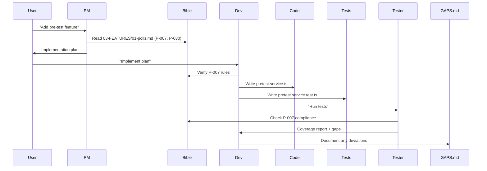

# Enterprise SaaS Boilerplate - Claude Code Rules
> Gold Standard | January 2026 | Version 1.0

---

## ⚠️ STRICT RULES - NO EXCEPTIONS

### Code Style
- **NO semicolons**
- **NO comments** (only section dividers: ═══ and ───)
- **Exports at end of file** (RFCE pattern)
- **Code in English** (all code, variable names, function names, comments in code)
- **Chat responses in Turkish** (explanations, summaries, status updates)

### Build Quality
- **Zero Warnings**: No warnings in compile time, no peer dependency warnings
- **Version Pinning**: All packages across monorepo MUST use exact same versions (managed via pnpm.overrides in root package.json)
- **React Version**: 19.1.0 (pinned across all packages: web, mobile, ui)
- **Type Safety**: @types/react and @types/react-dom MUST match React version exactly
- **Deprecated Warnings**: Suppressed via .npmrc loglevel=error (transitive deps only)
- **No @types for Built-in Types**: Don't use @types/uuid, @types/lodash etc. if package has built-in TS support

### Architecture Principles
- **Modular Structure**: Every feature in its own module, clear boundaries
- **Zero Redundancy**: No duplicate code, DRY strictly enforced
- **MVC Pattern**: Clear separation (Models → Services → Controllers → Routes)
- **Readability**: Self-documenting code, meaningful names, consistent patterns
- **Scalability**: Horizontal scaling ready, stateless services
- **Zero Hardcode**: All config in env/constants, no magic strings/numbers
- **Type Safety**: Strict TypeScript, no `any`, no `as` casts (except edge cases)
- **Fail Fast**: Validate early, throw early, handle at boundaries

### Workflow Rules
1. **Documentation Consistency**: Every code change MUST match documentation. Mismatch → ASK user.
2. **Post-Task Verification**: After each task verify code ↔ docs consistency. Inconsistency → ASK user.
3. **Security First**: Every endpoint must consider auth, rate limiting, input validation.

### Communication Rules (STRICTLY ENFORCED)
- **NO emojis**: Professional technical communication only
- **NO casual tone**: Formal, result-oriented language
- **NO unnecessary pleasantries**: Direct, efficient responses
- **Quality-focused**: Every response must demonstrate technical rigor
- **Turkish responses**: All explanations, summaries, status updates in Turkish
- **Code in English**: All code, variable names, function names, comments

---

## Tech Stack (January 2026 Standard)

### Core Infrastructure
| Layer | Technology | Why |
|-------|------------|-----|
| Runtime | Node.js 22+ | Native TypeScript, top performance |
| Package Manager | pnpm 9.x | Fast, disk efficient, strict |
| Monorepo | Turborepo | Incremental builds, caching |
| Language | TypeScript 5.7+ | Strict mode, latest features |
| Edge Runtime | Hono on Vercel Edge / Cloudflare Workers | Global low-latency |

### Backend (packages/api)
| Component | Technology | Why |
|-----------|------------|-----|
| Framework | Hono | 10x faster than Express, edge-native |
| Database | Drizzle ORM + PostgreSQL | Type-safe, no query overhead |
| DB Driver | postgres.js | Fastest Node.js PG driver |
| Cache | Redis (ioredis) | Session, rate limiting, queues |
| Auth | JWT (jose) | Web Crypto API, modern |
| Validation | Zod | Runtime + TypeScript inference |
| Logging | Pino | Fastest JSON logger |
| Tracing | OpenTelemetry | Distributed tracing |
| Error Tracking | Sentry | Real-time error monitoring |
| Payments | Stripe | Industry standard |
| Storage | AWS S3 + CloudFront | Scalable, CDN delivery |
| WebSocket | ws + Redis PubSub | Real-time, horizontally scalable |
| Email | Resend / AWS SES | Transactional emails |
| Queue | BullMQ + Redis | Background jobs |
| Search | Meilisearch / Typesense | Fast full-text search |
| API Docs | Scalar (OpenAPI 3.1) | Interactive documentation |

### Frontend (packages/web)
| Component | Technology | Why |
|-----------|------------|-----|
| Framework | Next.js 16 (App Router) | RSC, streaming, edge |
| React | 19.x | Concurrent features, compiler |
| Styling | Tailwind CSS 4 | Utility-first, JIT |
| Components | shadcn/ui | Accessible, customizable |
| State | TanStack Query v5 | Server state management |
| Forms | React Hook Form + Zod | Type-safe forms |
| i18n | next-intl | Type-safe translations |
| Analytics | Vercel Analytics / Plausible | Privacy-focused |

### Mobile (packages/mobile)
| Component | Technology | Why |
|-----------|------------|-----|
| Framework | React Native 0.81 + Expo SDK 54 | Cross-platform, React 19.1, New Architecture |
| Navigation | Expo Router v6 | File-based routing |
| Styling | NativeWind v4 | Tailwind for RN |
| State | TanStack Query | Same as web |

### Desktop (packages/desktop)
| Component | Technology | Why |
|-----------|------------|-----|
| Framework | **Tauri 2.0** | 3MB bundle, Rust security |
| UI | Shared React components | Code reuse |
| IPC | Tauri commands | Type-safe Rust ↔ JS |

### Shared Packages
```
packages/
├── database/      # Drizzle schema, migrations, client
├── validators/    # Zod schemas (shared frontend/backend)
├── shared/        # Types, utilities, constants
├── ui/            # React components (shadcn-based)
├── actions/       # Server actions
├── api/           # Hono API
├── web/           # Next.js frontend
├── mobile/        # Expo app
└── desktop/       # Tauri app
```

### DevOps & Infrastructure
| Component | Technology | Why |
|-----------|------------|-----|
| Containers | Docker + Docker Compose | Local dev parity |
| Orchestration | Kubernetes / AWS ECS | Production scaling |
| CI/CD | GitHub Actions | Automated pipelines |
| Hosting API | AWS ECS / Railway / Fly.io | Auto-scaling |
| Hosting Web | Vercel | Edge, ISR, analytics |
| Database | AWS RDS / Neon / Supabase | Managed PostgreSQL |
| Redis | Upstash / AWS ElastiCache | Managed Redis |
| CDN | CloudFront / Vercel Edge | Global distribution |
| Secrets | AWS Secrets Manager / Doppler | Secure config |
| Monitoring | Grafana + Prometheus | Metrics dashboard |
| Uptime | BetterStack / Checkly | Alerting |

---

## Security Standards

### Authentication & Authorization
- JWT access tokens (15 min expiry)
- Refresh token rotation (7 day expiry, single use)
- HttpOnly, Secure, SameSite=Strict cookies
- RBAC (Role-Based Access Control)
- Rate limiting per user/IP

### API Security
```typescript
// Every route MUST have:
- Authentication middleware (auth/optionalAuth)
- Rate limiting middleware
- Input validation (Zod)
- Output sanitization
```

### Headers (Hono secureHeaders)
```
Strict-Transport-Security: max-age=31536000; includeSubDomains
X-Content-Type-Options: nosniff
X-Frame-Options: DENY
Content-Security-Policy: default-src 'self'
Referrer-Policy: strict-origin-when-cross-origin
```

### Data Protection
- Passwords: Argon2id (not bcrypt)
- Encryption at rest: AES-256
- Encryption in transit: TLS 1.3
- PII handling: GDPR/KVKK compliant
- SQL injection: Parameterized queries (Drizzle handles)
- XSS: React auto-escapes, CSP headers

---

## Performance Standards

### API Response Times
| Type | Target | Max |
|------|--------|-----|
| Read (cached) | <20ms | 50ms |
| Read (DB) | <50ms | 200ms |
| Write | <100ms | 500ms |
| Search | <50ms | 200ms |

### Frontend Metrics (Core Web Vitals)
| Metric | Target |
|--------|--------|
| LCP | <2.5s |
| FID | <100ms |
| CLS | <0.1 |
| TTFB | <200ms |

### Database
- Connection pooling (min: 5, max: 20)
- Query timeout: 5s
- Indexes on all foreign keys and frequently queried fields
- Read replicas for heavy read workloads

---

## Database Patterns (Drizzle)

```typescript
// ═══════════════════════════════════════════════════════════════════════════
// QUERY PATTERNS
// ═══════════════════════════════════════════════════════════════════════════

// Single record
const [user] = await db
  .select()
  .from(users)
  .where(eq(users.id, id))
  .limit(1)

// With relations
const [user] = await db.query.users.findFirst({
  where: eq(users.id, id),
  with: { posts: true }
})

// Insert
const [result] = await db
  .insert(users)
  .values(data)
  .returning()

// Update
const [updated] = await db
  .update(users)
  .set(data)
  .where(eq(users.id, id))
  .returning()

// Transaction
await db.transaction(async (tx) => {
  await tx.insert(orders).values(order)
  await tx.update(inventory).set({ stock: sql`stock - 1` })
})

// ═══════════════════════════════════════════════════════════════════════════
// TYPE PATTERNS
// ═══════════════════════════════════════════════════════════════════════════

type User = InferSelectModel<typeof users>
type NewUser = InferInsertModel<typeof users>
```

---

## File Structure Standards

```typescript
// ═══════════════════════════════════════════════════════════════════════════
// SERVICE FILE STRUCTURE
// ═══════════════════════════════════════════════════════════════════════════

// packages/api/src/services/user.service.ts

import { db, eq, users } from "@voxpoll/database"
import type { InferSelectModel } from "@voxpoll/database"

// ─────────────────────────────────────────────────────────────────────────────
// Types
// ─────────────────────────────────────────────────────────────────────────────

type User = InferSelectModel<typeof users>

interface CreateUserInput {
  email: string
  username: string
}

// ─────────────────────────────────────────────────────────────────────────────
// Service Functions
// ─────────────────────────────────────────────────────────────────────────────

async function findById(id: string): Promise<User | null> {
  const [user] = await db
    .select()
    .from(users)
    .where(eq(users.id, id))
    .limit(1)

  return user ?? null
}

async function create(input: CreateUserInput): Promise<User> {
  const [user] = await db
    .insert(users)
    .values(input)
    .returning()

  return user!
}

// ─────────────────────────────────────────────────────────────────────────────
// Exports
// ─────────────────────────────────────────────────────────────────────────────

export const userService = {
  findById,
  create,
}

export type { User, CreateUserInput }
```

---

## Testing Standards

```typescript
// Unit tests: Vitest
// Integration tests: Vitest + testcontainers
// E2E tests: Playwright

// Coverage targets:
// - Services: >90%
// - Controllers: >80%
// - Utils: 100%
```

---

## Git Conventions

```bash
# Commit format (Conventional Commits)
feat(api): add user registration endpoint
fix(web): resolve login redirect loop
docs(readme): update installation steps
refactor(database): optimize query performance
test(auth): add token refresh tests

# Branch naming
feature/user-registration
fix/login-redirect
refactor/database-optimization
```

---

## Environment Variables

```bash
# Required for all environments
DATABASE_URL=
REDIS_URL=
JWT_SECRET=
JWT_REFRESH_SECRET=

# Production only
SENTRY_DSN=
STRIPE_SECRET_KEY=
AWS_ACCESS_KEY_ID=
AWS_SECRET_ACCESS_KEY=
```

---

## Checklist: New Feature

- [ ] Database schema (if needed)
- [ ] Zod validators
- [ ] Service layer
- [ ] Controller/Route
- [ ] Tests (unit + integration)
- [ ] Documentation update
- [ ] Security review (auth, rate limit, validation)
- [ ] Performance check (<200ms response)

---

> **This document is the single source of truth.**
> Code MUST match this documentation.
> Any deviation requires user approval.

---

## 📖 Bible Integration

### Bible Nedir?
`docs/bible/` klasörü projenin tüm iş mantığını, kurallarını, user flow'larını ve teknik kararlarını içerir.
**Kod yazmadan önce ilgili bible section'ı okunmalıdır.**

### Bible Yapısı
```
docs/bible/
├── 00-MASTER/           # INDEX.md, DECISIONS.md
├── 01-VISION/           # Neden: Mission, principles
├── 02-USERS/            # Kim: Roles, permissions, verification
├── 03-FEATURES/         # Ne: Polls, surveys, tests, live, social
├── 04-DATA/             # Veri: Quality, reliability, fraud
├── 05-TECH/             # Nasıl: Architecture, API, security
├── 06-UX/               # Deneyim: Flows, UI specs
├── 07-EDGE/             # Edge cases, business rules
├── 08-AUTHORITATIVE/    # Override kararları (EN YÜKSEK ÖNCELİK)
├── 99-TRACKING/         # GAPS.md, AUDIT_CHANGELOG.md
└── _archive/            # Eski bible dosyaları (referans)
```

### Bible Hierarchy (Override Sırası)
```
1. 08-AUTHORITATIVE/*     <- EN YÜKSEK (diğer tüm kaynakları override eder)
2. 00-MASTER/DECISIONS.md <- Tüm P-xxx, T-xxx kararları
3. İlgili feature dosyası
4. 99-TRACKING/GAPS.md
```

### Her Kod Değişikliğinde
1. **Önce**: İlgili bible section'ını oku
2. **Kontrol**: 08-AUTHORITATIVE'da override var mı?
3. **Kontrol**: GAPS.md'de known issue var mı?
4. **Sonra**: Uyumsuzluk varsa → GAPS.md'ye kaydet
5. **Sonra**: Başarılı ise → AUDIT_CHANGELOG.md'ye not al

### Gap Kaydı Formatı (99-TRACKING/GAPS.md)
```markdown
## [GAP-XXX] Kısa Başlık
- **Tarih**: YYYY-MM-DD
- **Durum**: [ ] Açık / [x] Çözüldü
- **Bible Kaynağı**: XX-CATEGORY/dosya.md#section
- **Kod Konumu**: packages/xxx/src/file.ts:line
- **Açıklama**: Detaylı açıklama
- **Çözüm** (çözüldüyse): Ne yapıldı
```

### Key Decisions (Hızlı Referans)
| ID | Karar | Kaynak |
|----|-------|--------|
| P-001 | Her poll tek soru | 03-FEATURES |
| P-003 | Reliability score 0-100 | 04-DATA |
| P-004 | Verification levels 0-4 | 02-USERS |
| T-006 | Argon2id (NOT bcrypt) | 05-TECH |
| T-009 | Reliability: Sample 35%, Response 30%, Method 20%, Verify 15% | 04-DATA |

### Detaylı Kurallar
Tam kurallar için: `docs/bible/99-TRACKING/CLAUDE_RULES.md`

---

## Multi-Agent Bible Workflow

### Role-Based Agent Structure

```
┌─────────────────────────────────────────────────────────────┐
│ BIBLE (Single Source of Truth)                             │
│ docs/bible/* - All business logic, flows, decisions        │
└─────────────────────────────────────────────────────────────┘
                            │
            ┌───────────────┼───────────────┬───────────┐
            │               │               │           │
    ┌───────▼─────┐  ┌─────▼──────┐  ┌────▼─────┐  ┌─▼──────┐
    │  PM Agent   │  │ Dev Agent  │  │ Debugger │  │ Tester │
    │ (Planning)  │  │ (Coding)   │  │  Agent   │  │  Agent │
    └─────────────┘  └────────────┘  └──────────┘  └────────┘
```

### Agent Responsibilities

#### 1. Product Manager Agent
- **Input**: Bible sections, user requirements
- **Output**: Implementation plan, feature specs
- **Tasks**:
  - Bible compliance verification
  - Task breakdown
  - Gap identification
  - Decision documentation

#### 2. Developer Agent
- **Input**: PM plan, Bible rules
- **Output**: Production code, tests
- **Tasks**:
  - Code implementation
  - Unit test writing
  - Bible rule enforcement
  - GAPS.md updates

#### 3. Debugger Agent
- **Input**: Error logs, failing tests
- **Output**: Root cause analysis, fixes
- **Tasks**:
  - Error investigation
  - Bug reproduction
  - Fix implementation
  - Regression prevention

#### 4. Tester/QA Agent
- **Input**: Bible flows, acceptance criteria
- **Output**: Test plans, test results
- **Tasks**:
  - Test plan creation (TEST_MASTER_PLAN.md)
  - Integration testing
  - Bible compliance verification
  - Coverage reporting

### Workflow Example



### Bible Compliance Checkpoints

1. **Before coding**: Read relevant Bible sections
2. **During coding**: Reference Decision IDs (P-xxx, T-xxx)
3. **After coding**: Update AUDIT_CHANGELOG.md
4. **If deviation**: Document in GAPS.md
5. **If blocked**: Escalate to user

### Communication Protocol

- PM Agent: High-level planning, Turkish responses
- Dev Agent: Code implementation, minimal Turkish
- Debugger: Error analysis, Turkish diagnostics
- Tester: Test reports, Turkish summaries

### Quality Gates

Each agent must verify:
- Bible compliance: 100%
- Test coverage: >80%
- Zero hardcoding
- Zero redundancy
- Type safety
- Security standards
