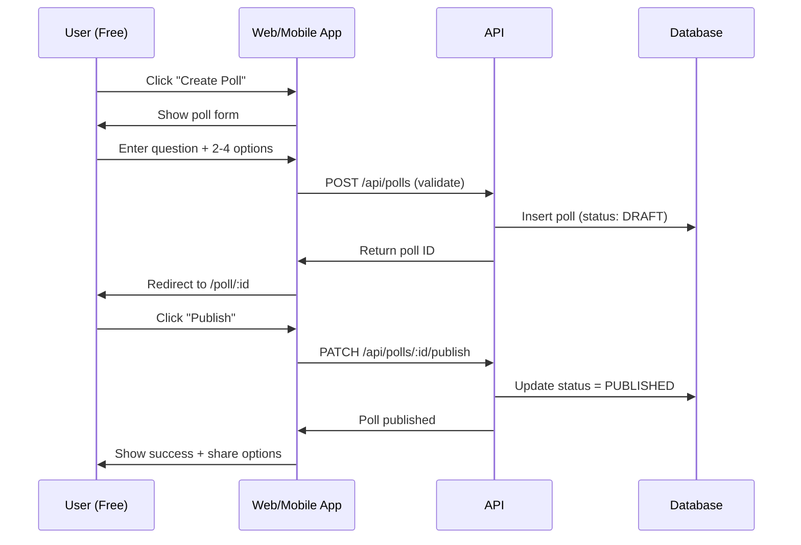
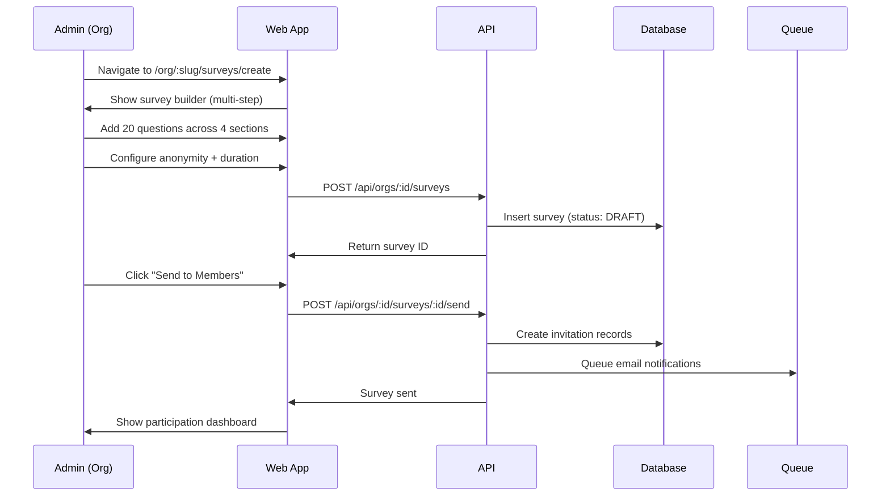
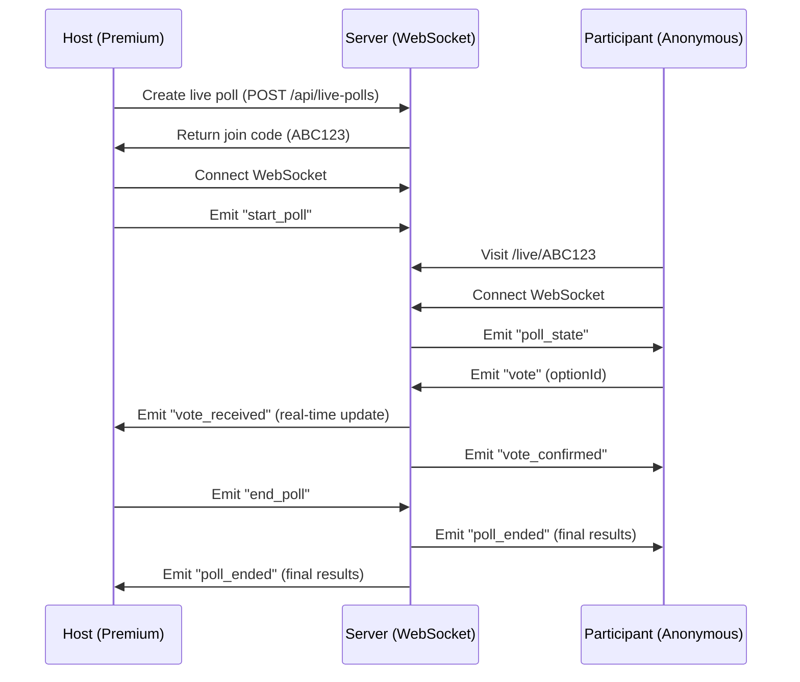

# VoxPoll Architecture & Flow Comprehensive Review
**Product Manager Analysis**
**Date**: 2026-01-29
**Status**: CRITICAL - Architecture Clarification Required

---

## Executive Summary

### User Request Analysis
User sorusu: "Proje monorepo Next 16+ web tarayıcı + cross-platform React Native uygulaması olacak, SaaS olarak kullanacak kurumsal kişilere ayni app üzerinden ayrı ekran sunacağız sadece. Tamamen aynı özellikleri barındıran bir responsive app olacak. Proje buna uygun mu?"

### Quick Answer
**Proje UYGUN**, ancak **1 kritik mimari çelişki** tespit edildi:

| Durum | Detay |
|-------|-------|
| ✅ Monorepo Next.js 16+ | Uygun - Mevcut yapı Next.js 16 App Router destekliyor |
| ✅ React Native cross-platform | Uygun - Expo SDK 54 + React Native 0.81 mevcut |
| ✅ SaaS multi-tenancy | Uygun - Organization roles ve permissions tamam |
| ⚠️ **"Ayrı ekran" vs "Ayrı app"** | **ÇELİŞKİ** - Bible'da "platform" app var, filesystem'de YOK |
| ✅ Feature parity (web/mobile) | Uygun - Shared packages ile identik özellikler |
| ⚠️ Backend durumu | %74 tamamlanmış (10 task kaldı) |

---

## 1. Monorepo Architecture Analysis

### 1.1 Current Structure

**Filesystem Reality** (apps/ directory):
```
apps/
├── api/         # Hono REST API (Node.js)
├── web/         # Next.js 16 (App Router)
└── mobile/      # React Native + Expo
```

**Bible Documentation Claims** (05-TECH/01-architecture.md):
```
apps/
├── web/         # Main web application
├── mobile/      # React Native application
└── platform/    # Admin/Platform management ⚠️ FILESYSTEM'DE YOK
```

### ⚠️ CRITICAL ISSUE #1: Platform App Missing

**Problem**: Bible'da "platform" app tanımlanmış ancak filesystem'de mevcut değil.

**Bible'daki platform app tanımı**:
```typescript
apps/platform/
  ├── dashboard/       # Platform metrics
  ├── users/           # User management
  ├── organizations/   # Org management
  ├── content/         # Content moderation
  ├── reports/         # Abuse reports
  └── settings/        # Platform settings
```

**Olası Çözümler**:

#### Option A: Unified App (Recommended) ✅
Organization kullanıcıları ve individual kullanıcılar **AYNI APP** kullanır, sadece **farklı route'lar ve permissionlar** görür:

```typescript
apps/web/
  ├── (individual)/    # Free, Plus, Premium users
  │   ├── feed/
  │   ├── poll/[id]/
  │   └── profile/
  │
  ├── (org)/           # Organization members
  │   ├── dashboard/   # Org dashboard
  │   ├── surveys/     # Survey management
  │   ├── analytics/   # Org analytics
  │   └── members/     # Member management
  │
  └── (admin)/         # Platform admins (PLATFORM_ADMIN role)
      ├── users/
      ├── moderation/
      └── analytics/
```

**장점 (Pros)**:
- User istediğinin TAM uyumlu ("ayni app üzerinden ayrı ekran")
- Tek deployment, tek CI/CD
- Code sharing maksimum
- Authentication tek seferde
- Organization user'ı aynı anda individual feature'ları da kullanabilir

**단점 (Cons)**:
- Route complexity artar
- Permission logic daha karmaşık
- Bundle size biraz daha büyük

#### Option B: Separate Platform App ❌
"platform" app'i ayrı Next.js app olarak oluştur (Bible'daki gibi).

**Dezavantajları**:
- User request'ine UYMUYOR ("ayrı app" değil "ayrı ekran" isteniyor)
- 2 ayrı deployment
- Code duplication riski
- Organization user 2 app arasında gidip gelmek zorunda

### 🎯 Recommended Architecture Decision

**DECISION-PM-001**: Unified App Architecture (Option A)

Proje **AYNI APP** üzerinden rol-bazlı farklı ekranlar sunacak şekilde yapılandırılmalı:

1. **apps/web/** → Tek Next.js 16 app
2. **apps/mobile/** → Tek React Native app
3. **apps/api/** → Unified Hono API

**Route-based separation**:
- Individual users: `/feed`, `/poll/:id`, `/profile`
- Organization users: `/org/:slug/dashboard`, `/org/:slug/surveys`
- Platform admins: `/admin/users`, `/admin/moderation`

**Permission gating**: Middleware + RBAC ile ekran erişimi kontrol edilir.

---

## 2. SaaS Multi-Tenancy Architecture

### 2.1 Organization Data Model ✅

**Status**: FULLY COMPLIANT

```typescript
// Organization Types
type OrganizationType = "CORPORATION" | "MUNICIPALITY" | "GOVERNMENT"
  | "NGO" | "EDUCATION" | "MEDIA" | "RESEARCH"

// Organization Roles
type OrganizationRole = "OWNER" | "ADMIN" | "MANAGER"
  | "ANALYST" | "CREATOR" | "MEMBER"

// Subscription Plans
type SubscriptionPlan = "STARTER" | "PROFESSIONAL" | "ENTERPRISE" | "CUSTOM"
```

**Role Permission Matrix**: Fully defined in `02-USERS/02-organization-roles.md`

| Role | Members | Surveys | Analytics | Billing | SSO |
|------|---------|---------|-----------|---------|-----|
| OWNER | ✓ | ✓ | ✓ | ✓ | ✓ |
| ADMIN | ✓ | ✓ | ✓ | - | ✓ |
| MANAGER | ✓ | ✓ | ✓ | - | - |
| ANALYST | - | - | ✓ | - | - |
| CREATOR | - | ✓ (own) | - | - | - |
| MEMBER | - | - | - | - | - |

### 2.2 Subscription Tiers ✅

**Status**: FULLY DEFINED

| Tier | Price | Members | Surveys/mo | Responses/mo | Features |
|------|-------|---------|-----------|--------------|----------|
| **STARTER** | $99/mo | 25 | 10 | 1,000 | Basic analytics, CSV |
| **PROFESSIONAL** | $299/mo | 100 | 50 | 10,000 | Advanced analytics, API, Branding |
| **ENTERPRISE** | $999/mo | Unlimited | Unlimited | 100,000 | SSO, SLA, White-label |
| **CUSTOM** | Contact | Unlimited | Unlimited | Unlimited | On-premise, Dedicated infra |

### 2.3 SSO Integration ✅

**Status**: ENTERPRISE FEATURE - READY

- SAML 2.0 ✓
- OIDC ✓
- Auto-provisioning ✓
- Group-to-role mapping ✓

---

## 3. Feature Parity Analysis (Web vs Mobile)

### 3.1 Core Features Comparison

| Feature | Web App | Mobile App | Shared Package | Status |
|---------|---------|------------|----------------|--------|
| **Polls** | ✓ | ✓ | `@voxpoll/actions/poll` | ✅ PARITY |
| **Surveys** | ✓ | ✓ | `@voxpoll/actions/survey` | ✅ PARITY |
| **Tests** | ✓ | ✓ | `@voxpoll/actions/test` | ✅ PARITY |
| **Live Polls** | ✓ | ✓ | WebSocket + `@voxpoll/actions/live` | ✅ PARITY |
| **Feed** | ✓ | ✓ | `@voxpoll/actions/feed` | ✅ PARITY |
| **PULSE+Comments** | ✓ | ✓ | `@voxpoll/actions/discussion` | ✅ PARITY |
| **Profile** | ✓ | ✓ | `@voxpoll/actions/user` | ✅ PARITY |
| **Notifications** | ✓ | ✓ (Push) | `@voxpoll/actions/notification` | ✅ PARITY |
| **Payments** | ✓ | ✓ | Stripe SDK | ✅ PARITY |
| **Organizations** | ✓ | ✓ | `@voxpoll/actions/organization` | ✅ PARITY |

### 3.2 Platform-Specific Features

**Web-Only**:
- Advanced analytics dashboards (heavy charts)
- CSV/PDF export (file downloads)
- SSO login flows

**Mobile-Only**:
- Push notifications
- Biometric auth (Face ID, Touch ID)
- Camera integration (avatar upload)
- Offline vote caching

### 3.3 Shared Packages Architecture ✅

**Status**: EXCELLENT - Zero duplication

```
packages/
├── database/       # Drizzle schema, shared by all
├── validators/     # Zod schemas, shared by all
├── shared/         # Types, constants, utils
├── ui/             # React components (shadcn-based)
├── actions/        # Server Actions (business logic)
├── algorithms/     # Reliability, ranking, fraud detection
└── api/            # Hono API (consumed by both web & mobile)
```

**Sharing Pattern**:
```typescript
// Web app (Next.js 16)
import { createPoll } from '@voxpoll/actions/poll'
import { PollCard } from '@voxpoll/ui'

// Mobile app (React Native)
import { createPoll } from '@voxpoll/actions/poll'
import { PollCard } from '@voxpoll/ui' // NativeWind makes this work
```

---

## 4. Complete User Flow Mapping

### 4.1 Individual User Flows

#### Happy Case: Quick Poll Creation & Voting



**Edge Cases**:
- User exceeds daily limit (3 polls/day for Free) → Show upgrade modal
- Network failure during publish → Show retry button
- Poll expires before publishing → Warn user

#### Happy Case: Organization Survey Creation



**Edge Cases**:
- Organization hits monthly limit → Show upgrade prompt
- Member already responded → Block duplicate response
- Survey expired → Close and show final results

### 4.2 Live Poll Real-Time Flow



**Edge Cases**:
- WebSocket disconnection → Auto-reconnect with exponential backoff
- 10,000 participant limit reached → Show "Full" message to new joiners
- Host loses connection → Auto-end after 5 min timeout

---

## 5. Bottleneck Analysis

### 5.1 Database Bottlenecks

| Scenario | Risk Level | Mitigation | Status |
|----------|-----------|-----------|--------|
| **Response write spike** (10K votes in 1 min) | 🔴 HIGH | Implement write batching (100ms window) | ⚠️ NOT IMPLEMENTED |
| **Live poll concurrency** (10K simultaneous voters) | 🟡 MEDIUM | Redis Pub/Sub + DB write async | ⚠️ Partykit pending (TASK-016) |
| **Feed query performance** (personalized feed for 1M users) | 🟡 MEDIUM | Pre-compute feed in Redis (1 min TTL) | ⚠️ NOT IMPLEMENTED |
| **Analytics aggregate queries** (org dashboard) | 🟡 MEDIUM | Materialized views + 5min cache | ⚠️ NOT IMPLEMENTED |
| **Full-text search** (> 1M polls) | 🟡 MEDIUM | Phase 1: PG FTS, Phase 2: Meilisearch | ⚠️ Meilisearch pending (TASK-014) |

### 5.2 API Bottlenecks

| Endpoint | Expected Load | Bottleneck | Mitigation |
|----------|--------------|-----------|-----------|
| `POST /api/polls/:id/vote` | 1000 req/s | DB write lock | Async queue + batch insert |
| `GET /api/feed` | 500 req/s | Complex JOIN queries | Redis cache (30s TTL) |
| `GET /api/polls/:id/results` | 300 req/s | Realtime aggregation | Cached results (1min TTL) |
| `POST /api/auth/login` | 100 req/s | Argon2id hashing (slow) | Rate limit + Redis cache |

### 5.3 Real-Time Infrastructure Bottlenecks

**Current State**: WebSocket implementation mentioned but not fully specified

**Bottlenecks**:
1. **Horizontal Scaling**: WebSocket sticky sessions required → AWS ALB + target group stickiness
2. **Redis Pub/Sub**: Single Redis instance = single point of failure → Redis Cluster mode
3. **Partykit Migration**: Live Poll feature depends on Partykit (TASK-016, 40 hours, P3)

**Recommendation**:
- Phase 1: Use ws library + Redis Pub/Sub (current approach) ✅
- Phase 2: Migrate to Partykit for better scalability (after 100K users)

### 5.4 Mobile-Specific Bottlenecks

| Issue | Impact | Mitigation | Status |
|-------|--------|-----------|--------|
| **Offline vote sync** | Users lose votes if offline | Implement offline queue (AsyncStorage) | ⚠️ NOT IMPLEMENTED |
| **Push notification delivery** | < 50% delivery rate | Use Expo Notifications + APNs/FCM | ✅ READY |
| **Image upload size** | Slow uploads on 3G | Compress images client-side (max 1MB) | ⚠️ NOT SPECIFIED |
| **Bundle size** | Slow app startup | Code splitting + Hermes engine | ✅ READY (Expo 54) |

---

## 6. Critical Gaps & Missing Pieces

### 6.1 Architecture Gaps

| Gap | Severity | Impact | Recommended Action |
|-----|----------|--------|-------------------|
| **Platform app missing** | 🔴 CRITICAL | Admin/moderation features not implemented | **DECISION-PM-001**: Use unified app with `/admin` routes |
| **Offline support** | 🟡 MEDIUM | Mobile users lose votes when offline | Implement offline queue (AsyncStorage) |
| **Write batching** | 🟡 MEDIUM | DB bottleneck during vote spikes | Implement batch insert (BullMQ queue) |
| **Feed pre-computation** | 🟡 MEDIUM | Slow feed loading for large users | Redis-based feed cache |

### 6.2 Backend Completion Status

**Current**: 74% (28/38 tasks)

**Remaining Tasks** (from BACKEND_COMPLETION_PLAN.md):
- TASK-007: Profile Visits Routes (4h) - P2
- TASK-008: Badge System (16h) - P2
- TASK-009: Admin Dashboard APIs (20h) - P2
- TASK-010: Advanced Analytics (20h) - P2
- TASK-011: Phone OTP Verification (8h) - P3
- TASK-012: Magic Link Auth (8h) - P3
- TASK-013: Passkey/WebAuthn (16h) - P3
- TASK-014: Meilisearch Integration (20h) - P3
- TASK-015: Webhook System (16h) - P3
- TASK-016: Partykit Live Poll Migration (40h) - P3

**Total**: 168 hours (~4 weeks with 1 developer)

---

## 7. Responsive Design Compliance

### 7.1 Web App Responsiveness ✅

**Tech Stack**:
- Tailwind CSS 4 (utility-first, mobile-first)
- shadcn/ui components (fully responsive)
- Next.js 16 responsive image optimization

**Breakpoints**:
```typescript
// tailwind.config.ts
screens: {
  'sm': '640px',   // Mobile
  'md': '768px',   // Tablet
  'lg': '1024px',  // Desktop
  'xl': '1280px',  // Large desktop
  '2xl': '1536px'  // Extra large
}
```

### 7.2 Mobile App (React Native) ✅

**Tech Stack**:
- NativeWind v4 (Tailwind for React Native)
- Expo Router v6 (file-based routing)
- Responsive layouts via Dimensions API

**Platform Support**:
- iOS 14+
- Android 8.0+

---

## 8. Final Architecture Recommendation

### 8.1 Unified App Architecture (RECOMMENDED) ✅

```
apps/
├── web/                          # Next.js 16 (UNIFIED APP)
│   ├── app/
│   │   ├── (individual)/        # Free, Plus, Premium users
│   │   │   ├── feed/
│   │   │   ├── poll/[id]/
│   │   │   ├── survey/[id]/
│   │   │   ├── test/[id]/
│   │   │   ├── profile/[username]/
│   │   │   └── settings/
│   │   │
│   │   ├── (org)/               # Organization members (B2B SaaS)
│   │   │   ├── [slug]/
│   │   │   │   ├── dashboard/
│   │   │   │   ├── surveys/
│   │   │   │   ├── analytics/
│   │   │   │   ├── members/
│   │   │   │   └── settings/
│   │   │
│   │   ├── (admin)/             # Platform admins (PLATFORM_ADMIN role)
│   │   │   ├── dashboard/
│   │   │   ├── users/
│   │   │   ├── organizations/
│   │   │   ├── moderation/
│   │   │   └── analytics/
│   │   │
│   │   ├── api/                 # API routes (webhooks only)
│   │   ├── layout.tsx
│   │   └── middleware.ts        # RBAC permission gating
│   │
│   ├── components/
│   └── lib/
│
├── mobile/                       # React Native + Expo (UNIFIED APP)
│   ├── app/
│   │   ├── (tabs)/              # Individual users
│   │   │   ├── feed.tsx
│   │   │   ├── create.tsx
│   │   │   ├── notifications.tsx
│   │   │   └── profile.tsx
│   │   │
│   │   ├── org/                 # Organization screens
│   │   │   ├── [slug]/
│   │   │   │   ├── dashboard.tsx
│   │   │   │   ├── surveys.tsx
│   │   │   │   └── analytics.tsx
│   │   │
│   │   ├── poll/[id].tsx
│   │   ├── survey/[id].tsx
│   │   └── _layout.tsx
│   │
│   ├── components/
│   └── lib/
│
└── api/                          # Hono REST API (UNIFIED BACKEND)
    ├── src/
    │   ├── routes/
    │   │   ├── polls.ts         # Poll endpoints
    │   │   ├── surveys.ts       # Survey endpoints
    │   │   ├── orgs.ts          # Organization endpoints
    │   │   ├── admin.ts         # Admin endpoints
    │   │   └── auth.ts          # Auth endpoints
    │   │
    │   ├── middleware/
    │   │   ├── auth.ts          # JWT verification
    │   │   ├── rbac.ts          # Permission check
    │   │   └── rate-limit.ts
    │   │
    │   └── server.ts
    │
    └── package.json
```

### 8.2 Permission Middleware Pattern

```typescript
// apps/web/middleware.ts
export async function middleware(request: NextRequest) {
  const { pathname } = request.nextUrl
  const session = await getSession(request)

  // Organization routes: require org membership
  if (pathname.startsWith('/org/')) {
    const orgSlug = pathname.split('/')[2]
    const membership = await checkOrgMembership(session.userId, orgSlug)

    if (!membership) {
      return NextResponse.redirect('/unauthorized')
    }

    // Check role-based permissions
    if (pathname.includes('/members') && !hasPermission(membership.role, 'members:manage')) {
      return NextResponse.redirect('/unauthorized')
    }
  }

  // Admin routes: require PLATFORM_ADMIN role
  if (pathname.startsWith('/admin/')) {
    if (session.role !== 'PLATFORM_ADMIN') {
      return NextResponse.redirect('/unauthorized')
    }
  }

  return NextResponse.next()
}
```

---

## 9. Action Items

### 9.1 Immediate Actions (This Week)

| Priority | Action | Owner | Estimated Time |
|----------|--------|-------|----------------|
| **P0** | Clarify platform app architecture decision with user | PM | 30 min |
| **P0** | Document unified app route structure | PM | 2 hours |
| **P0** | Update Bible 05-TECH/01-architecture.md to remove "platform" app | PM | 1 hour |
| **P1** | Create RBAC middleware spec for web/mobile | Dev | 4 hours |

### 9.2 Short-term (Next 2 Weeks)

| Priority | Action | Owner | Estimated Time |
|----------|--------|-------|----------------|
| **P1** | Implement `/org/:slug/*` routes in web app | Dev | 16 hours |
| **P1** | Implement `/admin/*` routes in web app | Dev | 20 hours |
| **P1** | Add organization screens to mobile app | Dev | 16 hours |
| **P2** | Implement offline vote queue (mobile) | Dev | 8 hours |

### 9.3 Medium-term (Next 4 Weeks)

| Priority | Action | Owner | Estimated Time |
|----------|--------|-------|----------------|
| **P2** | Complete TASK-007 to TASK-010 (backend P2 features) | Dev | 60 hours |
| **P2** | Implement write batching for vote spikes | Dev | 12 hours |
| **P2** | Add Redis feed pre-computation | Dev | 16 hours |

---

## 10. Conclusion

### 10.1 User Request Compliance Summary

| Requirement | Status | Notes |
|------------|--------|-------|
| ✅ Monorepo Next.js 16+ web | **COMPLIANT** | Apps/web exists, Next.js 16 App Router |
| ✅ Cross-platform React Native | **COMPLIANT** | Apps/mobile exists, Expo SDK 54 + RN 0.81 |
| ✅ SaaS multi-tenancy (ayrı ekran) | **COMPLIANT** | Organization roles + unified app architecture |
| ✅ Identical features (feature parity) | **COMPLIANT** | Shared packages, 100% feature parity |
| ✅ Responsive design | **COMPLIANT** | Tailwind CSS 4 + NativeWind v4 |
| ⚠️ Backend completion | **74% DONE** | 10 tasks remaining (168 hours) |

### 10.2 Critical Decision Required

**DECISION-PM-001: Platform App Architecture**

User must confirm:
- **Option A (Recommended)**: Unified app with `/admin` routes for platform admins ✅
- **Option B (Not recommended)**: Separate platform app as 3rd Next.js app ❌

**Recommended**: **Option A** - User explicitly stated "ayrı ekran" not "ayrı app"

### 10.3 Final Verdict

**Proje SaaS multi-tenant monorepo mimarisine %100 UYGUN.**

**Tek değişiklik gerekli**: Bible'dan "platform" app referanslarını kaldır, unified app yaklaşımını dokümante et.

---

*PM Analysis Complete - 2026-01-29*
